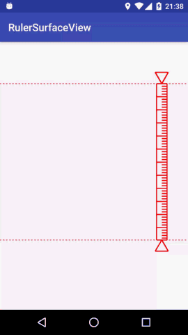

RulerSurfaceView
================

#Preview



#build.gradle
In your project root path ```build.gradle``` file, add this:

```groovy
allprojects {
	repositories {
		...
		maven { url "https://jitpack.io" }
	}
}
```

And in your module path ```build.gradle``` file, add this:

```groovy
dependencies {
        compile 'com.github.onlynight:RulerSurfaceView:0.0.1'
}
```

#use

```xml
<com.github.onlynight.rulersurfaceview.library.RulerSurfaceView
    android:id="@+id/rulerView"
    android:layout_width="match_parent"
    android:layout_height="match_parent"
    app:dash_line_blank="3dp"
    app:line_color="#ff0000"
    app:line_height="1dp"
    app:line_type="dash_line"
    app:measure_icon_size="25dp"
    app:measure_ruler_scale_width="5dp"
    app:measure_ruler_width="20dp"
    app:measure_text_color="@color/colorAccent"
    app:measure_text_size="18sp"
    app:ruler_color="#ff0000"
    app:ruler_line_height="2dp" />
```

#XML property explain

```xml
<declare-styleable name="RulerSurfaceView">

    <!-- The mark line at the ends of ruler's line type -->
    <attr name="line_type" format="enum">
        <enum name="dash_line" value="1" />
        <enum name="line" value="2" />
    </attr>

    <!-- If the mark line is dash line,
     you can define the dash line blank.
     The default value is 3dp-->
    <attr name="dash_line_blank" format="dimension" />

    <!-- The mark line height.
    The default value is 1px.-->
    <attr name="line_height" format="dimension" />

    <!-- The mark line color.
    The default value is Color.WHITE.-->
    <attr name="line_color" format="color" />

    <!-- The ruler line color.
    The default value is Color.WHITE.-->
    <attr name="ruler_color" format="color" />

    <!-- The ruler line height.
    The default value is 2dp.-->
    <attr name="ruler_line_height" format="dimension" />

</declare-styleable>
```

#Source Code Analysis

There's a Chinese source code analysis here [Source Code], in the future maybe you can see the english version.
国内的小伙伴就有福利啦，可以直接查看中文版的源码解析[源码]。

#License

```
Copyright 2016 onlynight

Licensed under the Apache License, Version 2.0 (the "License");
you may not use this file except in compliance with the License.
You may obtain a copy of the License at

   http://www.apache.org/licenses/LICENSE-2.0

Unless required by applicable law or agreed to in writing, software
distributed under the License is distributed on an "AS IS" BASIS,
WITHOUT WARRANTIES OR CONDITIONS OF ANY KIND, either express or implied.
See the License for the specific language governing permissions and
limitations under the License.
```

[Source Code]: https://github.com/onlynight/RulerView
[源码]: https://github.com/onlynight/RulerView